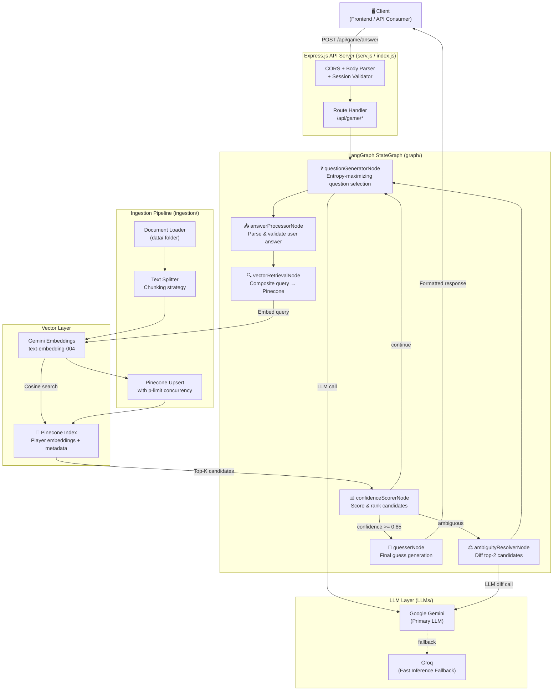
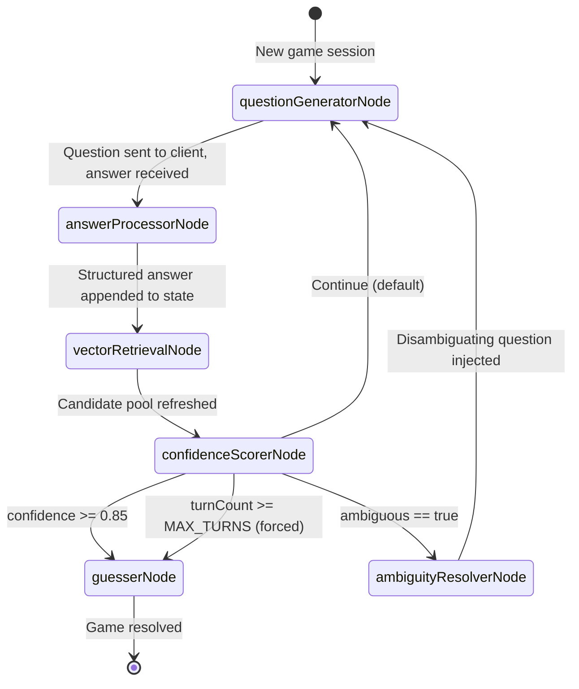
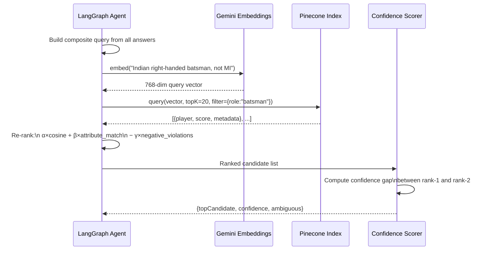
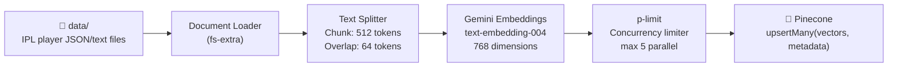

<div align="center">


# 🏏 IPL Akinator — Agentic AI Player Guessing Engine

**An intelligent, conversational IPL player identification system powered by a multi-node LangGraph agent, semantic vector retrieval via Pinecone, and Google Gemini reasoning — inspired by Akinator.**

The system asks you strategic yes/no questions about an IPL cricketer you have in mind, narrows the candidate pool turn-by-turn using vector similarity and confidence scoring, resolves ambiguous states autonomously, and arrives at a final guess — just like Akinator, but grounded in real cricket knowledge.

[**Live Demo**](https://github.com/Priyanshughost/Agentic_backend) · [**Report Bug**](https://github.com/Priyanshughost/Agentic_backend/issues) · [**Request Feature**](https://github.com/Priyanshughost/Agentic_backend/issues)

</div>

---

## 📖 Table of Contents

1. [What Is This?](#-what-is-this)
2. [How It Works — High Level](#-how-it-works--high-level)
3. [LangGraph Workflow — Deep Dive](#-langgraph-workflow--deep-dive)
4. [Vector Retrieval System](#-vector-retrieval-system)
5. [Confidence Scoring Engine](#-confidence-scoring-engine)
6. [Semantic Memory Architecture](#-semantic-memory-architecture)
7. [Ambiguity Resolution Strategy](#-ambiguity-resolution-strategy)
8. [System Architecture Diagrams](#-system-architecture-diagrams)
9. [Project Structure](#-project-structure)
10. [Tech Stack](#-tech-stack)
11. [Prerequisites](#-prerequisites)
12. [Installation & Setup](#-installation--setup)
13. [Environment Variables](#-environment-variables)
14. [Running the Server](#-running-the-server)
15. [API Reference](#-api-reference)
16. [Developer Notes](#-developer-notes)
17. [Roadmap](#-roadmap)
18. [Contributing](#-contributing)
19. [License](#-license)

---

## 🎯 What Is This?

The **IPL Akinator** is an agentic AI system that plays a guessing game. You think of any IPL cricketer — Virat Kohli, Jasprit Bumrah, MS Dhoni, or any player from any franchise — and the AI agent will identify them by asking a series of targeted, adaptive yes/no questions.

What makes this different from a simple Q&A chatbot:

- **It is genuinely agentic.** The system uses a LangGraph state machine where each node makes a decision that influences the next action. It is not a linear prompt chain.
- **It has real memory.** Every answer you give is embedded into a session state that semantically constrains the search space turn-by-turn.
- **It retrieves, it does not memorize.** Player knowledge lives in a Pinecone vector index. The agent retrieves and re-ranks candidates based on accumulated context — the knowledge base can be updated without redeployment.
- **It handles uncertainty.** When multiple players score similarly, the agent enters an explicit ambiguity resolution mode and generates a surgical disambiguating question rather than guessing blindly.

---

## 🔍 How It Works — High Level

```
You think of a player
        │
        ▼
Agent asks: "Does your player bat right-handed?"
        │
        ▼
You answer: "Yes"
        │
        ▼
Agent embeds your clue → queries Pinecone → filters candidate pool
Agent scores all remaining candidates → picks the most information-maximizing attribute
Agent asks the next most discriminating question
        │
        ▼
[... repeat for N turns ...]
        │
        ▼
Confidence exceeds threshold → Agent guesses: "Is it Rohit Sharma?"
        │
       Yes → Game over 🎉
        No → Agent removes that player, re-ranks, continues
```

Each question is not random. The agent selects the attribute that maximally separates the current candidate pool — a strategy derived from information theory (entropy minimization across candidates).

---

## 🧠 LangGraph Workflow — Deep Dive

The core of this system is a **LangGraph StateGraph** — a directed graph where nodes are functions that read and write to a shared state object, and edges (including conditional edges) determine the flow of execution.

### State Schema

```js
// Conceptual representation of the graph state (Zod-validated)
{
  sessionId:        string,        // unique game session identifier
  turnCount:        number,        // how many questions have been asked
  askedAttributes:  string[],      // attributes already used as questions
  userAnswers:      Answer[],      // { attribute, value, turn } array
  candidatePool:    Player[],      // current list of possible players
  topCandidate:     Player|null,   // leading candidate this turn
  confidenceScore:  number,        // 0–1 float; triggers guess when >= 0.85
  gameStatus:       "active" | "guessing" | "resolved" | "failed",
  nextQuestion:     string,        // the question to present to the user
  ambiguous:        boolean,       // whether the top-2 candidates are too close
  messages:         BaseMessage[]  // LangChain message history for LLM context
}
```

### Graph Nodes

The graph consists of six nodes. Each is a pure async function that receives state and returns a partial state update.

| Node | Responsibility |
|---|---|
| `questionGeneratorNode` | Selects the highest-entropy attribute not yet asked; generates a natural-language question via Gemini |
| `answerProcessorNode` | Parses and validates the user's free-text answer into a structured `{ attribute, value }` pair |
| `vectorRetrievalNode` | Builds a composite query from all user answers; retrieves and re-ranks the candidate pool from Pinecone |
| `confidenceScorerNode` | Scores each candidate against accumulated clues; updates `confidenceScore` and `topCandidate` |
| `ambiguityResolverNode` | Fires when top-2 candidates are within 0.05 confidence of each other; generates a surgical discriminating question |
| `guesserNode` | Fires when `confidenceScore >= 0.85`; generates a natural-language guess and updates `gameStatus` |

### Conditional Routing

```
START
  │
  ▼
[questionGeneratorNode]
  │
  ▼
[answerProcessorNode]
  │
  ▼
[vectorRetrievalNode]
  │
  ▼
[confidenceScorerNode]
  │
  ├──► confidence >= 0.85 ──────────────► [guesserNode] ──► END
  │
  ├──► ambiguous == true ───────────────► [ambiguityResolverNode] ──► [questionGeneratorNode]
  │
  ├──► turnCount >= MAX_TURNS ──────────► [guesserNode] (forced guess) ──► END
  │
  └──► otherwise ──────────────────────► [questionGeneratorNode] (next turn)
```

LangGraph's `addConditionalEdges` expresses this logic cleanly:

```js
graph.addConditionalEdges("confidenceScorerNode", (state) => {
  if (state.confidenceScore >= CONFIDENCE_THRESHOLD) return "guesserNode";
  if (state.ambiguous)                               return "ambiguityResolverNode";
  if (state.turnCount >= MAX_TURNS)                  return "guesserNode";
  return "questionGeneratorNode";
});
```

The graph does **not** use a simple while loop. Each node invocation is a discrete step that can be interrupted, inspected, replayed, or checkpointed — which is what makes LangGraph suitable for production agentic systems.

---

## 🔎 Vector Retrieval System

Player knowledge is stored in **Pinecone** as high-dimensional embeddings. Each player is represented not as a single vector, but as a **multi-document profile**: one embedding per attribute cluster.

### Embedding Strategy

```
Player Profile: "Virat Kohli"
  ├── chunk_1: "Right-handed batsman. Plays for RCB. Known for..."
  ├── chunk_2: "Delhi-born. International career since 2008. Test captain..."
  └── chunk_3: "Batting style: aggressive top-order. Strike rate in T20..."

Each chunk → Gemini text-embedding-004 → 768-dim vector → upserted to Pinecone
Metadata:  { playerName, team, role, nationality, era, attributes: {...} }
```

### Query Construction

At each turn, `vectorRetrievalNode` constructs a **composite natural-language query** from the full history of confirmed attributes:

```
Turn 3 context:
  - bats right-handed: YES
  - plays for MI: NO
  - is Indian: YES
  - is a bowler: NO

→ Composite query: "Indian right-handed batsman who does not play for Mumbai Indians"
→ Gemini embeds this query → cosine similarity search in Pinecone
→ Top-K results returned with similarity scores
```

### Re-ranking

Raw Pinecone similarity scores are not used directly. A secondary re-ranking pass combines:

- **Cosine similarity** from Pinecone (semantic match)
- **Attribute filter match rate** (how many hard-boolean clues the candidate satisfies)
- **Negative constraint penalty** (heavy discount if candidate violates any confirmed "NO" answer)

```
final_score(player) =
  α × cosine_similarity
  + β × attribute_match_rate
  − γ × negative_violation_count
```

Where `α`, `β`, `γ` are tunable weights (default: `0.5, 0.35, 0.4`).

---

## 📊 Confidence Scoring Engine

After each retrieval round, `confidenceScorerNode` computes a confidence score for the leading candidate.

### Scoring Formula

```
confidence = (top_score − second_score) / top_score × decay_factor(turn)
```

- **`top_score`** — the re-ranked score of the leading candidate
- **`second_score`** — the score of the runner-up
- **`decay_factor`** — a sigmoid function of turn count that prevents premature guessing in early turns even if one candidate happens to dominate

```js
const decayFactor = (turn) => 1 / (1 + Math.exp(-(turn - 4)));
```

This means even if the model is 99% sure after turn 1, the decay factor holds confidence below the `0.85` threshold until at least turn 4, ensuring a minimum of meaningful interaction.

### Confidence Lifecycle

```
Turn 1:  confidence = 0.12  → ask more
Turn 3:  confidence = 0.41  → ask more
Turn 5:  confidence = 0.68  → ask more
Turn 7:  confidence = 0.87  → GUESS → "Is it MS Dhoni?"
```

If the guess is rejected, that player is **hard-excluded** from the Pinecone retrieval metadata filter for the remainder of the session, and confidence resets to the new top candidate's score.

---

## 🧩 Semantic Memory Architecture

Each game session maintains a **semantic memory** — not a raw chat log, but a structured accumulation of confirmed facts that progressively narrows the semantic search space.

### How Memory Works

```
Initial state: candidatePool = all ~500 IPL players in Pinecone

Turn 1 answer: "is a bowler = YES"
  → Pinecone metadata filter: { role: "bowler" } applied
  → candidatePool shrinks to ~180 players

Turn 2 answer: "is left-arm = YES"
  → Composite query + filter
  → candidatePool: ~60 players

Turn 3 answer: "plays for CSK = NO"
  → Negative constraint stored; penalty applied in re-ranking
  → Effective candidatePool: ~48 players

Turn 5 answer: "is from Pakistan = YES"
  → candidatePool: ~12 players
  → confidenceScore crosses 0.85 for one candidate
  → GUESS: "Is it Shaheen Afridi?"
```

Memory is implemented as **append-only**. Answers are never revised or deleted — only accumulated — which mirrors how real Akinator works. The LLM receives the entire `messages` history on each turn for coherence.

### Why Not Just Use Chat History?

Pure chat history passed to an LLM has no structural filtering ability — the LLM would have to re-derive the candidate pool from scratch each turn via pure reasoning, which is slow, expensive, and error-prone. By externalising memory into Pinecone metadata filters, the system separates **semantic reasoning** (what to ask next) from **symbolic filtering** (who still qualifies) — giving you the best of both worlds.

---

## ⚖️ Ambiguity Resolution Strategy

The hardest problem in any guessing game is when two or more candidates are nearly identical in their attribute profiles. Consider **Hardik Pandya** and **Ravindra Jadeja** — both are Indian all-rounders who have played for major IPL franchises. Generic questions won't separate them.

### Detection

The system flags ambiguity when:

```js
const isAmbiguous = (scores) =>
  Math.abs(scores[0].score - scores[1].score) < AMBIGUITY_THRESHOLD; // 0.05
```

### Resolution

When `ambiguous == true`, the graph routes to `ambiguityResolverNode`, which:

1. Takes the **top-2 candidates** and their full attribute profiles from Pinecone metadata.
2. Computes the **symmetric difference** of their attribute sets — the attributes where they differ.
3. Prompts Gemini to generate **a single natural-language question** targeting the most differentiating attribute:

```
System: You are resolving ambiguity between two IPL players.
Player A: Hardik Pandya — attributes: { batting: right, bowling: right-arm medium, team: MI, ... }
Player B: Ravindra Jadeja — attributes: { batting: left, bowling: left-arm spin, team: CSK, ... }

Key differences: batting hand, bowling style, home team.
Generate ONE yes/no question that would conclusively differentiate these two players.
Do NOT reveal the player names. Be natural and conversational.
```

4. Gemini responds: `"Does your player bowl pace rather than spin?"`
5. This resolves the ambiguity in a single turn.

This strategy is superior to random question selection because it **guarantees information gain** in the next turn.

---

## 🗺️ System Architecture Diagrams

### Full System Overview



---

### LangGraph Execution Flow



---

### Vector Retrieval Pipeline



---

### Ingestion Pipeline



---

## 📁 Project Structure

```
Agentic_backend/
│
├── index.js                      # App bootstrap: imports routes, starts Express
├── serv.js                       # Express app config: middleware, CORS, error handling
├── package.json                  # Dependencies and module type (ESM)
├── .gitignore
│
├── LLMs/                         # LLM provider initialisation
│   ├── gemini.js                 # Google Gemini chat + embedding client setup
│   └── groq.js                   # Groq LLM client (fast inference fallback)
│
├── graph/                        # LangGraph agent definition
│   ├── gameGraph.js              # Main StateGraph: nodes, edges, conditional routing
│   ├── state.js                  # Zod schema for graph state
│   └── nodes/
│       ├── questionGenerator.js  # Entropy-maximizing question selection
│       ├── answerProcessor.js    # Free-text answer parsing + validation
│       ├── vectorRetrieval.js    # Composite query → Pinecone → re-rank
│       ├── confidenceScorer.js   # Score candidates, detect ambiguity
│       ├── ambiguityResolver.js  # Diff top-2 candidates, generate pivot question
│       └── guesser.js            # Final guess generation
│
├── ingestion/                    # One-time / on-demand data ingestion
│   ├── ingest.js                 # Main ingestion runner
│   ├── loader.js                 # Loads and parses player data files
│   ├── splitter.js               # Text chunking with overlap
│   └── upserter.js               # Pinecone upsert with p-limit concurrency
│
├── data/                         # Raw IPL player knowledge base
│   ├── players/                  # Individual player profiles (JSON / text)
│   └── teams/                    # Team metadata
│
└── utils/                        # Shared utilities
    ├── promptTemplates.js        # LangChain PromptTemplate definitions
    ├── scoring.js                # Re-ranking and confidence math
    ├── sessionStore.js           # In-memory session state management
    └── logger.js                 # Structured logging utility
```

---

## 🛠️ Tech Stack

| Technology | Version | Purpose |
|---|---|---|
| **Node.js** | ≥ 18.x | Runtime (ES Modules required) |
| **Express** | v5.x | HTTP server, routing, middleware |
| **LangGraph** | `@langchain/langgraph ^1.3` | Stateful agentic graph execution |
| **LangChain Core** | `@langchain/core ^1.1` | Chains, messages, prompt templates |
| **LangChain Community** | `^1.1` | Document loaders, text splitters |
| **Google Gemini** | `@google/generative-ai ^0.24` | Primary LLM + text embeddings |
| **LangChain Google GenAI** | `^2.1` | LangChain-native Gemini wrapper |
| **Groq** | `@langchain/groq ^1.2` | Fast inference fallback LLM |
| **Pinecone** | `@pinecone-database/pinecone ^5.1` | Vector database for player embeddings |
| **LangChain Pinecone** | `^1.0` | LangChain VectorStore adapter |
| **Zod** | `^3.25` | Runtime schema validation for graph state |
| **dotenv** | `^16.4` | Environment variable management |
| **p-limit** | `^7.3` | Concurrency limiting during ingestion |
| **fs-extra** | `^11.3` | Extended filesystem operations |
| **cors** | `^2.8` | Cross-origin request middleware |
| **nodemon** | `^3.1` | Dev auto-reload |

---

## ✅ Prerequisites

Before you begin, ensure you have:

- **Node.js** `>= 18.0.0` — required for native ES Module support
- **npm** `>= 9.0.0`
- A **[Pinecone](https://www.pinecone.io/)** account with:
  - An index created with **dimension: 768** (Gemini `text-embedding-004` output size)
  - **Metric: cosine**
- A **[Google AI Studio](https://aistudio.google.com/)** API key (Gemini access)
- A **[Groq](https://console.groq.com/)** API key (optional; used as fallback)

---

## 🚀 Installation & Setup

### 1. Clone the Repository

```bash
git clone https://github.com/Priyanshughost/Agentic_backend.git
cd Agentic_backend
```

### 2. Install Dependencies

```bash
npm install
```

### 3. Configure Environment

```bash
cp .env.example .env
# Edit .env with your actual API keys (see Environment Variables below)
```

### 4. Run the Ingestion Pipeline

Before starting the game server, player data must be embedded and upserted into Pinecone. This is a **one-time step** (re-run whenever you update player data).

```bash
node ingestion/ingest.js
```

Expected output:
```
[Ingestion] Loading player files from data/players/ ...
[Ingestion] Loaded 500 player documents
[Ingestion] Splitting into chunks ... 1842 chunks created
[Ingestion] Embedding and upserting to Pinecone (concurrency: 5) ...
[Ingestion] ████████████████████ 100% — 1842/1842 vectors upserted
[Ingestion] ✅ Done in 47.3s
```

### 5. Start the Server

```bash
# Development (auto-reload)
npx nodemon index.js

# Production
node index.js
```

Server starts at: `http://localhost:3000`

---

## 🔐 Environment Variables

Create a `.env` file in the root directory:

```env
# ─── Server ───────────────────────────────────────────
PORT=3000
NODE_ENV=development

# ─── Google Gemini ────────────────────────────────────
GOOGLE_API_KEY=your_google_ai_studio_api_key

# ─── Groq (optional fallback LLM) ────────────────────
GROQ_API_KEY=your_groq_api_key

# ─── Pinecone ─────────────────────────────────────────
PINECONE_API_KEY=your_pinecone_api_key
PINECONE_INDEX=ipl-players          # Must match your Pinecone index name
PINECONE_NAMESPACE=prod             # Optional: use namespaces per environment

# ─── Game Config ──────────────────────────────────────
MAX_TURNS=20                        # Max questions before forced guess
CONFIDENCE_THRESHOLD=0.85           # Min confidence to trigger a guess
AMBIGUITY_THRESHOLD=0.05            # Max score gap to flag as ambiguous
TOP_K_RETRIEVAL=20                  # Candidates to fetch from Pinecone per turn
```

> ⚠️ **Never commit your `.env` file.** It is already listed in `.gitignore`.

---

## 📡 API Reference

> **Base URL:** `http://localhost:3000/api`

All responses follow the envelope format:
```json
{ "success": true, "data": { ... }, "error": null }
```

---

### `POST /game/start`

Initialise a new game session.

**Request:**
```json
{}
```

**Response:**
```json
{
  "success": true,
  "data": {
    "sessionId": "sess_7f3a91bc",
    "question": "Does your player bat right-handed?",
    "turnCount": 1,
    "gameStatus": "active"
  }
}
```

---

### `POST /game/answer`

Submit your answer to the current question.

**Request:**
```json
{
  "sessionId": "sess_7f3a91bc",
  "answer": "yes"
}
```

**Response (continuing):**
```json
{
  "success": true,
  "data": {
    "sessionId": "sess_7f3a91bc",
    "question": "Does your player play for a team based in Mumbai?",
    "turnCount": 2,
    "gameStatus": "active",
    "confidenceScore": 0.31,
    "candidateCount": 87
  }
}
```

**Response (guess triggered):**
```json
{
  "success": true,
  "data": {
    "sessionId": "sess_7f3a91bc",
    "gameStatus": "guessing",
    "guess": "Rohit Sharma",
    "guessQuestion": "Is the player you're thinking of Rohit Sharma?",
    "confidenceScore": 0.91,
    "turnCount": 7
  }
}
```

---

### `POST /game/verify`

Confirm or reject the agent's guess.

**Request:**
```json
{
  "sessionId": "sess_7f3a91bc",
  "correct": false
}
```

**Response (wrong guess — game continues):**
```json
{
  "success": true,
  "data": {
    "sessionId": "sess_7f3a91bc",
    "gameStatus": "active",
    "question": "Does your player bowl as well as bat?",
    "turnCount": 8,
    "confidenceScore": 0.54,
    "candidateCount": 12
  }
}
```

**Response (correct guess):**
```json
{
  "success": true,
  "data": {
    "sessionId": "sess_7f3a91bc",
    "gameStatus": "resolved",
    "totalTurns": 7,
    "message": "🎉 Got it! I knew it was Rohit Sharma!"
  }
}
```

---

### `GET /game/session/:sessionId`

Inspect the full current state of a session (useful for debugging).

**Response:**
```json
{
  "success": true,
  "data": {
    "sessionId": "sess_7f3a91bc",
    "turnCount": 5,
    "askedAttributes": ["batting_hand", "franchise", "nationality", "bowling_style", "era"],
    "userAnswers": [
      { "attribute": "batting_hand", "value": "right", "turn": 1 },
      { "attribute": "franchise",    "value": "not_mi", "turn": 2 }
    ],
    "candidatePool": ["Virat Kohli", "KL Rahul", "Shubman Gill", "..."],
    "confidenceScore": 0.67,
    "gameStatus": "active"
  }
}
```

---

### `POST /ingest`

Trigger the ingestion pipeline to re-embed and upsert player data.

**Request:**
```json
{ "source": "all" }
```

**Response:**
```json
{
  "success": true,
  "data": {
    "documentsLoaded": 500,
    "chunksCreated": 1842,
    "vectorsUpserted": 1842,
    "durationMs": 47312
  }
}
```

---

### `GET /health`

Health check endpoint.

**Response:**
```json
{
  "success": true,
  "data": {
    "status": "ok",
    "uptime": 3600,
    "pineconeConnected": true,
    "llmProvider": "gemini"
  }
}
```

---

## 🧑‍💻 Developer Notes

### Why LangGraph Over a Simple While-Loop?

A naive agentic guessing game could be built as a simple `while` loop calling an LLM repeatedly. LangGraph provides fundamentally different capabilities:

- **State persistence per node** — each step's input/output is inspectable and replayable
- **Conditional routing** — the graph topology itself encodes the game logic, not imperative `if/else` blocks scattered across a loop
- **Interrupt & resume** — LangGraph supports async interruption between nodes, making it trivially easy to add a human-in-the-loop confirmation step later
- **Observability** — every state transition is emitted as a structured event, enabling real-time streaming to a frontend

### Why Pinecone for a Game?

You could store player attributes in a JSON file and filter in-memory. For 500 players this works. For 5,000 players — or when you want **semantic** similarity (not just exact attribute matching) — a vector database becomes essential. Pinecone also provides:

- **Metadata filtering** — apply hard boolean constraints alongside semantic search in a single query
- **Namespaces** — isolate dev/prod environments or game categories (IPL vs ICC vs football)
- **Real-time updates** — add new players without restarting the server

### Extending the System

**Adding players from a new IPL season:**
Add profile files to `data/players/` and `POST /ingest` with `{ "source": "all" }`. Pinecone's upsert semantics handle deduplication automatically.

**Switching from Gemini to a different LLM:**
The `LLMs/` folder is designed for this. Add a new provider file and update the import in the relevant graph nodes — zero graph restructuring required.

**Adding new question categories:**
Add the attribute key to the state schema in `graph/state.js` and include values in the player JSON files. The `questionGeneratorNode` automatically discovers new attributes in its entropy calculation.

### Concurrency & Rate Limits

The ingestion pipeline uses `p-limit` to cap concurrent Pinecone upsert requests at 5, preventing rate-limit errors during bulk ingestion. For datasets larger than 10,000 vectors, batch upserts in groups of 100 using Pinecone's `upsertMany` with a batch size parameter.

### Session Management

Sessions are stored **in-memory** in `utils/sessionStore.js` for simplicity. For production deployments with multiple server instances, replace with a Redis-backed session store. The session interface is abstracted behind a simple `get/set/delete` API, making this a one-file swap.

---

## 🗺️ Roadmap

- [ ] **React frontend** — animated game UI with question cards and confidence meter
- [ ] **Redis session store** — production-grade multi-instance session management
- [ ] **LangGraph streaming** — stream agent thinking steps to the UI in real-time
- [ ] **Multi-sport support** — extend to ICC, football, kabaddi via Pinecone namespaces
- [ ] **Admin dashboard** — manage player data, view game analytics, monitor confidence distributions
- [ ] **Difficulty modes** — Easy (common players, basic attributes), Hard (all players, rare stats)
- [ ] **Docker + Compose** — containerised one-command deployment
- [ ] **LangSmith tracing** — full observability for every graph execution in production

---

## 🤝 Contributing

Contributions are welcome! Please follow these steps:

```bash
# 1. Fork the repository on GitHub

# 2. Create a feature branch
git checkout -b feature/your-feature-name

# 3. Commit your changes
git commit -m "feat: describe your change concisely"

# 4. Push and open a Pull Request
git push origin feature/your-feature-name
```

**Guidelines:**
- Follow the existing ESM import/export style throughout
- Add JSDoc comments for any new node functions
- If adding a new graph node, update the Mermaid diagrams in this README
- Test ingestion changes against a fresh Pinecone index before submitting

---

## 📄 License

Distributed under the **ISC License**. See [`LICENSE`](LICENSE) for details.

---

<div align="center">

**Built with LangGraph · Google Gemini · Pinecone · Express**

*Think of a player. The machine will find them.* 🏏

⭐ **Star this repo** if you found it useful — it helps others discover the project!

</div>